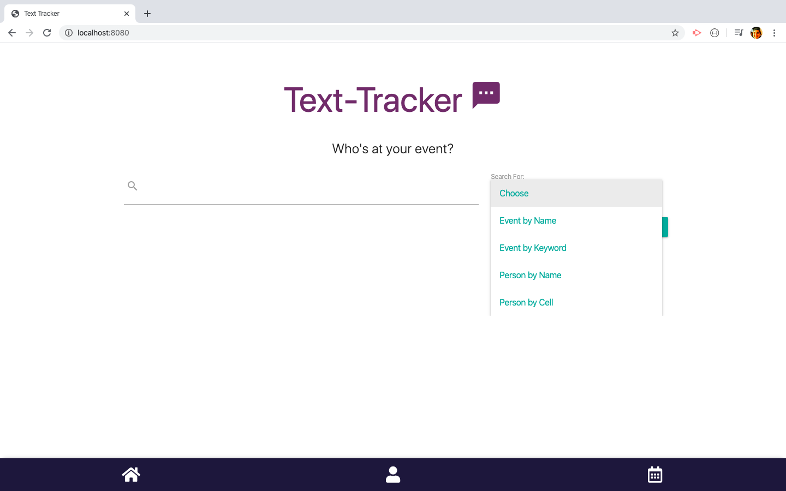
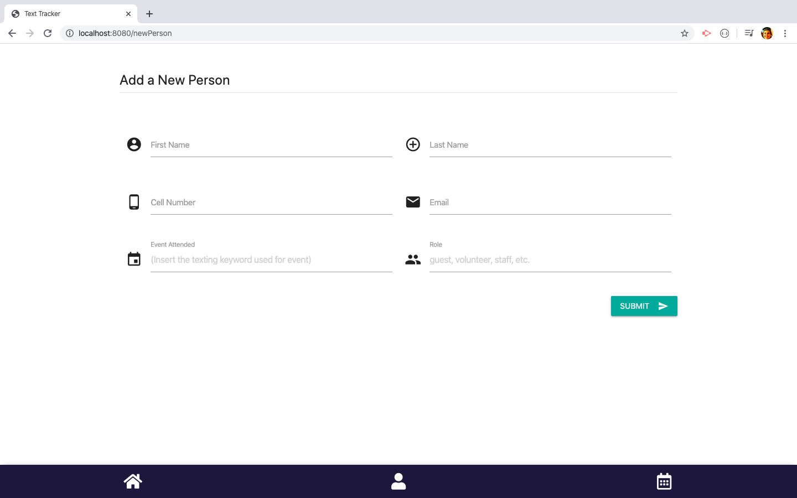
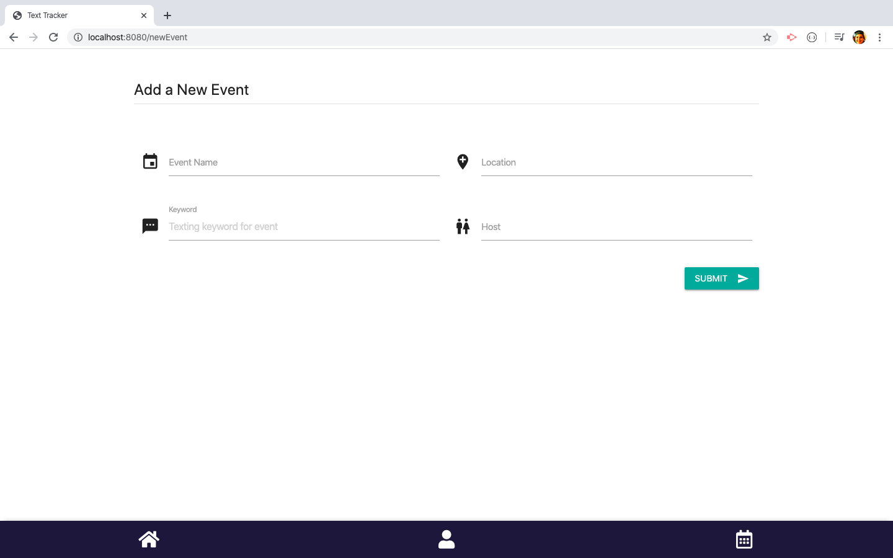

# Make Me Laugh!

1. Elevator Pitch

"Text Tracker" is an application designed for allowing users to track event attendance. It utilizes clearstream.io, a communications service which maintains and updates information via a webhook. In Text Tracker, clearstream's webhook works in conjuction with a MySQL database, as well as front-end webpages, to provide a full-stack platform. 

When someone attending an event wishes to check in, they text a code word affiliated with that specific event to a clearstream phone number. As a result of this, the attendee's first name, last name, and mobile number are automatically pushed from clearstream's webhook to Text Tracker's MySQL database without the need for making an API call. Because of this automated process, event hosts DO NOT need to manually sort through each and every incoming text in order to keep track of who did or did not check into an event. Rather, they can refer to the information in Text Tracker's MySQL database, which automatically receives data from the clearstream.io webhook.

Additionally, the front-end Text Tracker website allows users to manage information with ease. Hosts and event managers can input information for a new upcoming event (the event name, keyword and location) http://localhost:8080/newEvent, and attendees can initialize their personal information (name, email and cell number) http://localhost:8080/newPerson. In both these instances, the information submitted via the user-end is stored in Text Tracker's MySQL database.

More information about clearsteam.io can be found here <https://clearstream.io/>, and information about webhooks vs. APIs can be found here https://sendgrid.com/blog/webhook-vs-api-whats-difference/

2. Concept

User Story:

    AS AN   event host or attendee,
I WANT TO   utilize an an application like Text Tracker,
 SO I CAN   rely on an automated attendance process controlled through a database.
 

3. Process

    CSS libraries: 
    - Materialize

    Object-Relational Mapping tools:
    - Sequelize

    Overcoming Challenges:
    - Getting the server-side of our application to work in conjuction with the front-end was a challenge. Establishing API routes and HTML routes took work and thought in order to work effectivley.

    Successes:
    - Individually, 

4. Demo

5. Directions for Future Development
  

6. Links

    GH pages: <https://pmahalan.github.io/Project_2/>

    GH repository: <https://github.com/pmahalan/Project_2>

